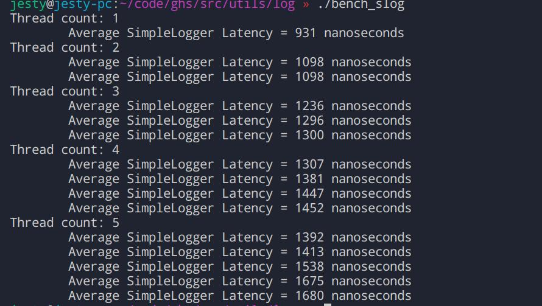
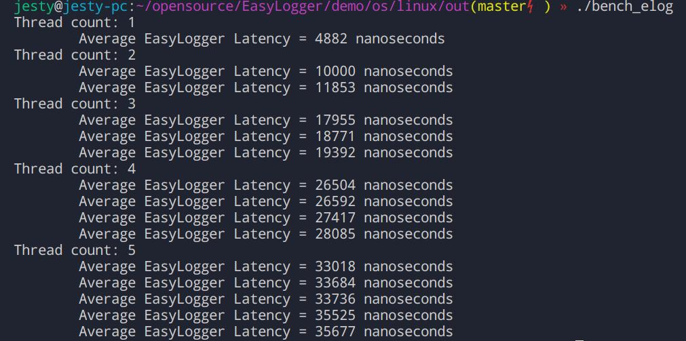

# SimpleLogger
a low latency logger in pure C

## How To Use
1. first, add those sources to your project, then include simple_logger.h in you project  
```C
#define LOG_TAG "slog"
#include "simple_logger.h"
```
You could set a tag for each .c/.cpp file. If you do not set it, the tag would not be displayed.  

2. start this logger  
```C
slog_start();
```

3. use this logger  
use slog_x(x is level), just like use printf. "\n" is not needed. 
```
// log level is VERBOSE
slog_v(fmt,...);
// log level is DEBUG
slog_d(fmt,...);
// log level is INFO
slog_i(fmt,...);
// log level is WARNING
slog_w(fmt,...);
// log level is ERROR
slog_e(fmt,...);
```

4. stop it  
be sure to stop it before program exit!  
```C
slog_stop();
```

## Simple Logger Setting

- slog_set_file
    - set log file path, if path is NULL, disable file output.
- slog_set_output_to_file
    - set whether output to file. if file is setten to NULL in `slog_set_file`, this function would not work,
- slog_set_content_for_each_level  
    - set log content for each log level    
    contents

    |contents|label|
    |:--:|:--:|
    |level|LOG_CONTENT_level|
    |time|LOG_CONTENT_TIME|
    |file, line, function of code|LOG_CONTENT_CODE_INFO|
    |pid, tid of current thread|LOG_CONTENT_THREAD_INFO|
    |tag, do not display if not setten|LOG_CONTENT_TAG|
    |every things|LOG_CONTENT_ALL|

    you could set content like this:
    ```C
    slog_set_content_for_each_level(LOG_LEVEL_INFO,LOG_CONTENT_ALL&(~LOG_CONTENT_CODE_INFO));
    ```
    by default, content is set to LOG_CONTENT_ALL  

- slog_set_color_output  
    set to 1, logs output to terminal is colorful.
- slog_set_level  
    set the minium log level would be displayed/saved.  
- slog_set_stdout_redirection  
    redirect stdout to another fp, such as stderr. if fp is NULL, logs would not output to terminal. 

## Design  
I use a ring queue to save the logs, and started anothre thread to output the log. 
## Latency Benchmark
  
Also, I tested another logger, [EasyLogger](https://github.com/armink/EasyLogger), written in pure C. 
  

## Reference  
EasyLogger: <https://github.com/armink/EasyLogger>  
NanoLogger: <https://github.com/Iyengar111/NanoLog>  
Thanks to those repo's author!